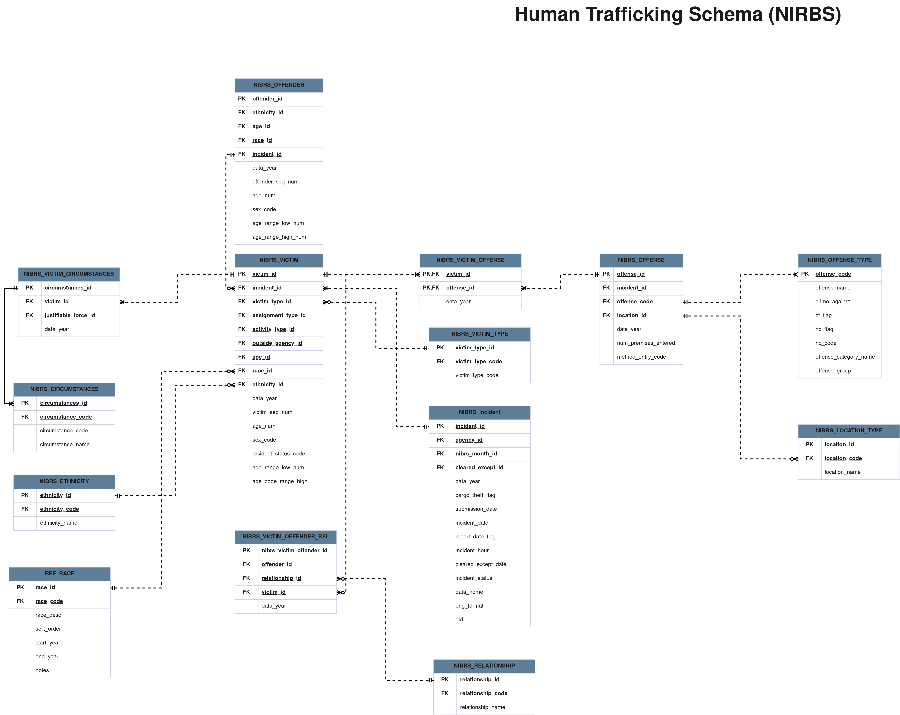

# **JoshuaProject**
Explore Humananitarian Events

## **Description**
The Joshua Project is an active extension of the ODIN project, dedicated to the comprehensive study and exploration of world events and critical issues, including Drug Trafficking, Cultivation, Human Trafficking, Violent & Sexual Crime, and Corruption and economic factors. This project focuses on in-depth research and analysis in Central Asia, European Countries, and the United States to gain valuable insights to study and identify patterns, root causes, and potential solutions to address these issues effectively. 

# **Human Trafficking ERD**

## **Project Dependencies** 
1. Pandas 
2. Numpy 
3. Scikit-Learn
4. Tensorflow 
5. Boto3 
6. Seaborn 
7. Matplotlib 

